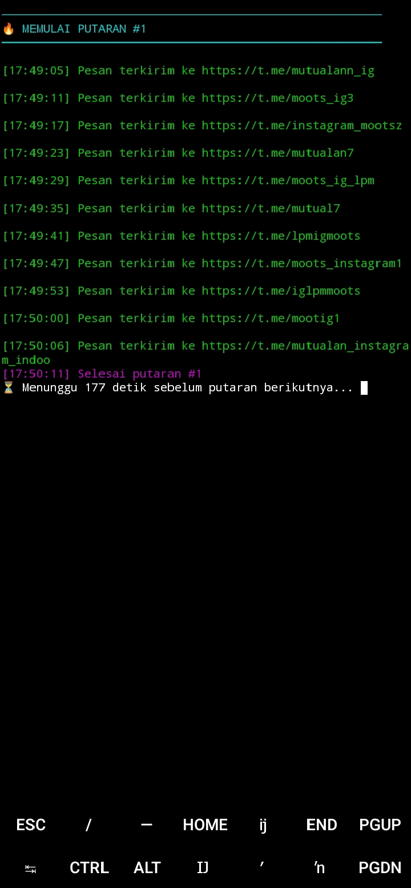

<div align="center">

# 🌀 Telegram Auto Sender by FR

### 🔥 Simple • Fast • Auto Config • Multiline Support  
Script otomatis untuk mengirim pesan ke banyak grup Telegram via Termux menggunakan **Telethon**.

<br>


</div>

---

## 📸 Preview

Tampilan saat script sedang berjalan:



---

## 📥 Download Termux (APK)

Jika Termux kamu belum terpasang atau versi Play Store sering error, gunakan versi yang paling stabil:

👉 **[Klik di sini untuk download Termux (APK)](https://f-droid.org/repo/com.termux_1002.apk)**

---

## 🔑 Cara Ambil API ID & API HASH (WAJIB)

Untuk menjalankan script, kamu harus punya API Telegram:

1. Buka: https://my.telegram.org/apps  
2. Login menggunakan nomor Telegram  
3. Masuk menu **API Development Tools**  
4. Isi data bebas lalu klik Continue  
5. Ambil:
   - **API ID**
   - **API HASH**

Masukkan saat script meminta.

---

## ⚙️ Instalasi Awal (Termux Baru)

Jalankan perintah berikut:

```bash
pkg update -y && pkg upgrade -y
```

```bash
pkg install git python -y
```

```bash
pip install --upgrade pip
```

---

## 🚀 Cara Install & Jalankan

```bash
git clone https://github.com/Fajarushandi/telethon-auto.git
```

```bash
cd telethon-auto
```

```bash
pip install -r requirements.txt
```

```bash
python main.py
```

---

## 🛑 Cara Stop Script (Paling Penting)

Jika script sedang looping / berjalan terus dan kamu ingin berhenti:

```
CTRL + C
```

Di HP Termux:
- Tekan tombol **CTRL**
- Lalu tekan **C**

Script akan langsung stop.

---

## 🎯 Fitur Utama

- Multiline message (akhiri dengan `END`)
- Auto looping atau sesuai jumlah putaran
- Countdown animasi dalam 1 baris
- UI warna premium & clean
- Kirim ke banyak grup sekaligus
- Auto save konfigurasi
- Tidak perlu edit file manual

---

## 📘 Panduan Pemula

### 📝 Cara Isi Pesan Multiline  
Ketik pesan → Enter → lanjut terus.  
Jika sudah selesai ketik:

```
END
```

---

### 🔗 Cara Isi Link Grup  
Pisahkan dengan koma:

```
https://t.me/grup1, https://t.me/grup2, https://t.me/grup3
```

---

### ⏱ Delay Antar Pesan  
- 3–8 detik → cepat  
- 10–20 detik → aman flood

---

### 🔁 Interval Putaran  
Contoh:

```
120 = 2 menit
```

---

### ♾️ Looping Terus?
- `y` → berjalan tanpa henti  
- `n` → berhenti sesuai jumlah putaran  

---

## ⭐ Support  
Kalau script ini membantu, jangan lupa kasih **STAR** di repo 😎🔥  
Biar makin naik kelas.
