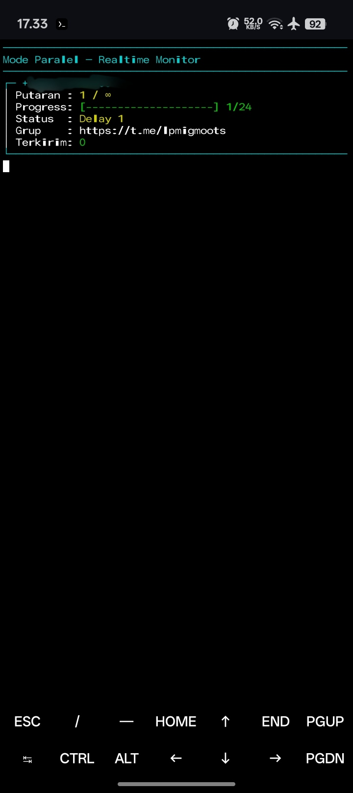
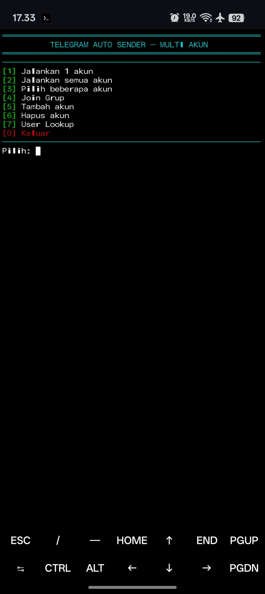

<div align="center">

# 🌀 Telegram Multi-Account Auto Sender by FR

### 🔥 Simple • Fast • Multi Account • Auto Config  
Script otomatis kirim pesan ke banyak grup Telegram via Termux menggunakan **Telethon**, dengan dukungan **multiakun + menu pemilihan akun**.

<br>


</div>

---

## 📸 Preview

Tampilan saat script sedang berjalan:

<p align="center">
  
  
</p>

---

## 📥 Download Termux (APK)

Jika Termux kamu belum terpasang atau versi Play Store sering error, gunakan versi yang paling stabil:

👉 **[Klik di sini untuk download Termux (APK)](https://f-droid.org/repo/com.termux_1002.apk)**

---

## 🔑 Cara Ambil API ID & API HASH (WAJIB)

Untuk menjalankan script, kamu harus punya API Telegram:

1. Buka: https://my.telegram.org/apps  
2. Login menggunakan nomor Telegram  
3. Masuk menu **API Development Tools**  
4. Isi data bebas lalu klik Continue  
5. Ambil:
   - **API ID**
   - **API HASH**

Masukkan saat script meminta.

---

## ⚙️ Instalasi Awal (Termux Baru)

Jalankan perintah berikut:

```bash
pkg update && pkg upgrade -y
```

```bash
pkg install git python -y
```

```bash
pip install --upgrade pip
```

---

## 🚀 Cara Install & Jalankan

```bash
git clone https://github.com/Fajarushandi/telethon-auto.git
```

```bash
cd telethon-auto
```

```bash
pip install -r requirements.txt
```

```bash
python main.py
```

---

## 🧩 Sistem Multi Akun (FITUR BARU)

Script sekarang mendukung **multiakun** dengan sistem menu:

Saat menjalankan script:

```
1. +628xxxxxxx
2. +628xxxxxxx
3. Tambah akun baru
```

### ✔ Pilih akun → script jalan pakai akun itu  
### ✔ Tambah akun baru → login & auto buat session  
### ✔ Setiap akun punya konfigurasi sendiri  
### ✔ Bisa pakai config lama / bikin baru (y/n)

Semua akun disimpan otomatis di:

```
accounts.json
```

---

## 🛑 Cara Stop Script (Penting)

Jika script sedang berjalan dan ingin berhenti:

```
CTRL + C
```

Di Termux HP:
- Tekan tombol **CTRL**
- Tekan **C**

---

## 🎯 Fitur Utama

- Multi akun (menu pemilihan akun)
- Auto simpan konfigurasi setiap akun
- Multiline message (END)
- Auto looping atau sesuai jumlah putaran
- Delay custom
- Countdown animasi 1 baris
- UI warna premium & clean
- Tidak perlu edit file manual
- Satu akun bisa punya config berbeda

---

## 📘 Panduan Pemula

### 📝 Cara Isi Pesan Multiline  
Ketik pesan → Enter terus.  
Akhiri dengan:

```
END
```

---

### 🔗 Cara Isi Link Grup  
Pisahkan dengan koma:

```
https://t.me/grup1, https://t.me/grup2, https://t.me/grup3
```

---

### ⏱ Delay Antar Pesan  
- 3–8 detik → cepat  
- 10–20 detik → aman ban  
- Bisa disesuaikan bebas

---

### 🔁 Interval Putaran  
Contoh:

```
120 = 2 menit
```

---

### ♾ Looping Terus?
- `y` → jalan terus  
- `n` → berhenti sesuai jumlah putaran  

---

## ⭐ Support  
Kalau script ini membantu, jangan lupa kasih **STAR** di repo 😎🔥  
Biar makin naik kelas.
